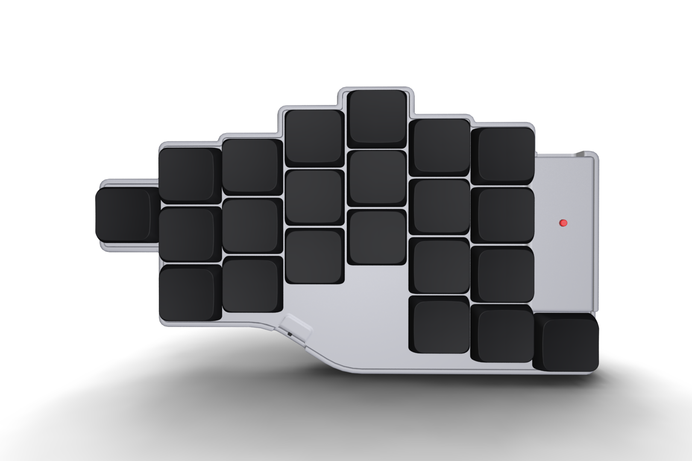
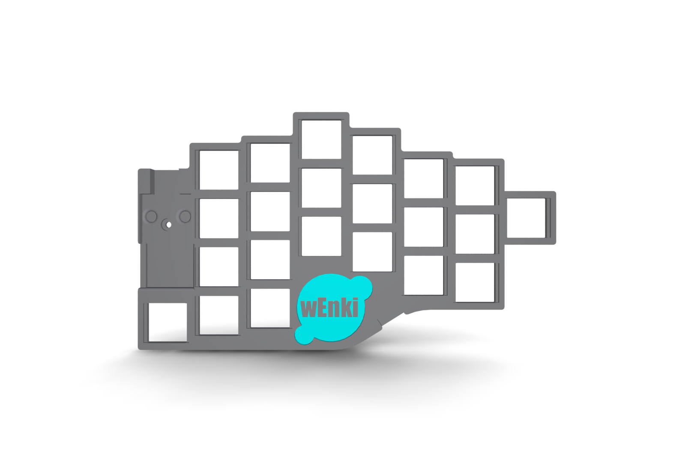
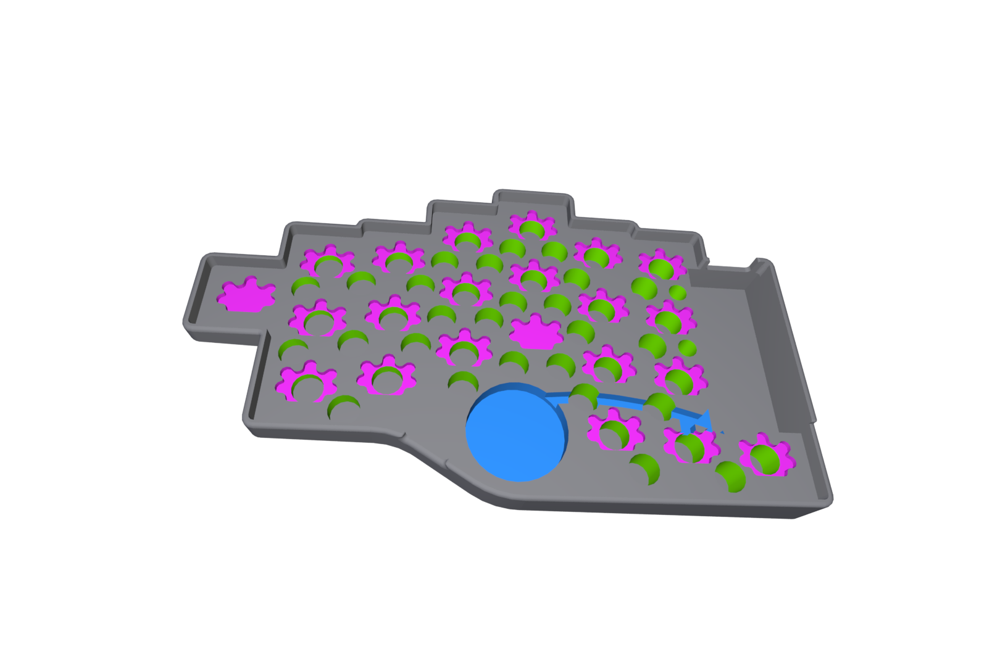

# CASE
 
For left-handed version you need to mirror the model.

The pcb is fixed by friction and screws. Use scale factor or sandpaper to fit details

# Print options: 
* Printer: Voxelab proxima
* Rafts: No
* Supports: Yes
* Resolution: 0.05mm
* Resin material: ABS-like

# STL
STL models for 44 & 42 variants can be downloaded in [releases](https://github.com/aroum/kalmar/releases).